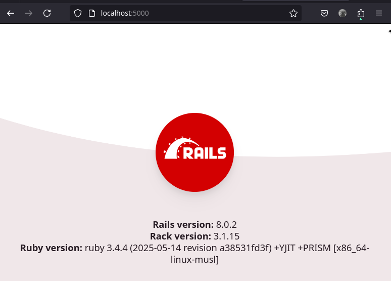
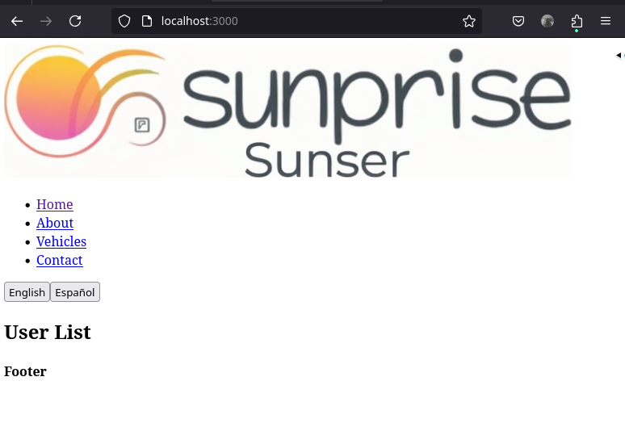

# Sunrise Sunset App

## Run application
```bash
./bin/start.sh up
```
http://localhost:5000/



http://localhost:3000/



## .env 

**Note:** To run this application, you'll need a `.env` file with several environment variables.