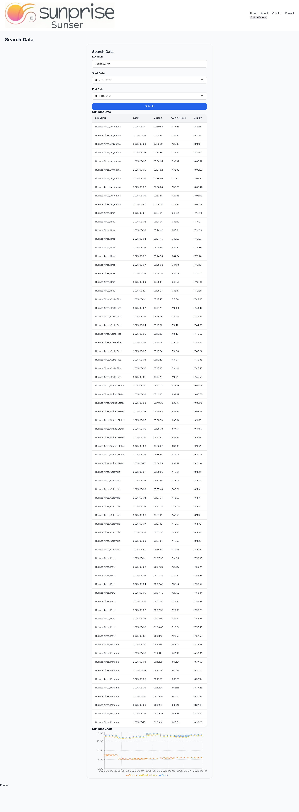
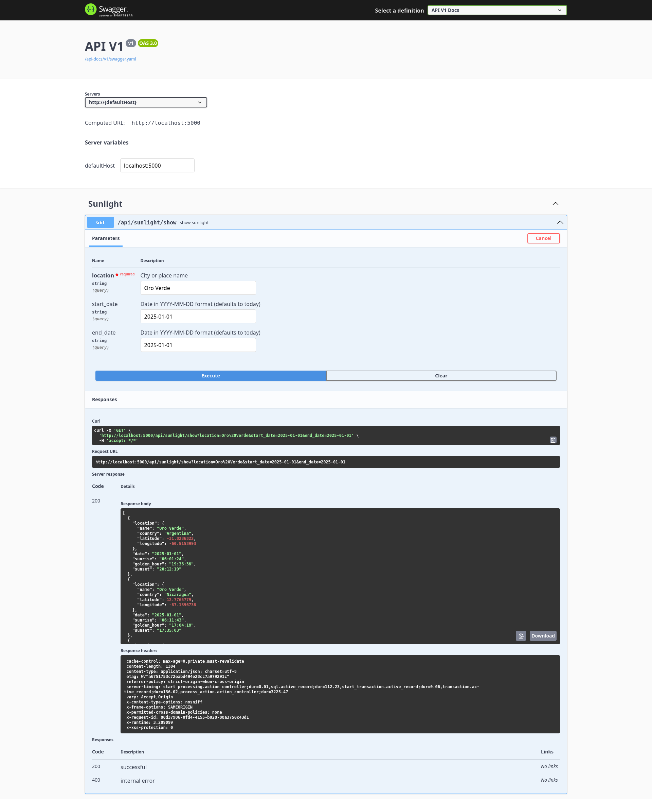

# Sunrise Sunset App

## Run application
```bash
# git clone https://github.com/ggerman/sunrise_sunset_app.git
# cd sunrise_sunset_app
# ./bin/start.sh up
```
http://localhost:5000/


http://localhost:3000/



## .env 

**Note:** To run this application, you'll need a `.env` file with several environment variables.

# API Documentation

http://localhost:5000/api-docs/index.html

